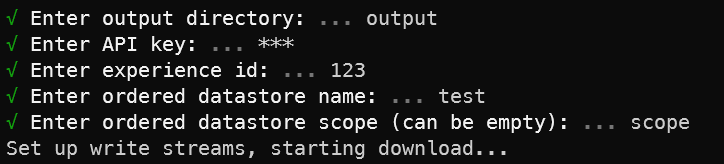

<div align="center">

# ordered-datastore-backup-tool

</div>
<p align="center">
    </img>
</p>
<div align="center">

Backs up an ordered datastore into a csv using [Roblox's Open Cloud API](https://create.roblox.com/docs/cloud/open-cloud).

</div>

# Download

Simply clone the repo (if you don't have git, [install it](https://git-scm.com/downloads)):

```bash
git clone https://github.com/ThatTimothy/ordered-datastore-backup-tool.git
```

# Usage

> Note: [Node v18+](https://nodejs.org/) is required

Simply run:

```bash
npm install
npm run run
```

Answer the inputs required, and the process will begin.
If you need to exit early, simply `Ctrl + C`, and the process with be paused.
To resume, simply enter the same output directory as before and the download will resume where it left off.

# Example output

I used this to download Roblox Uno's wins: https://github.com/ThisStudio/roblox-uno-wins

# License

Please see [LICENSE.md](LICENSE.md)
